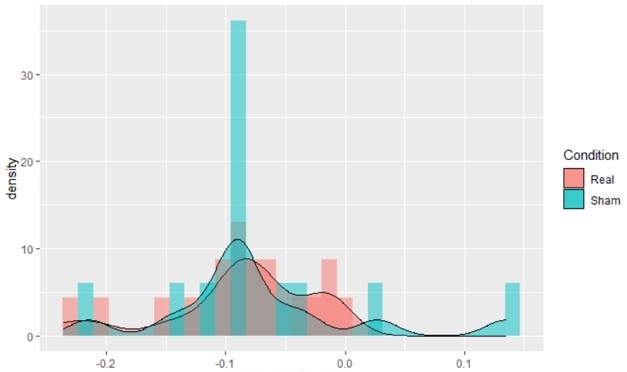

# Welcome

Glad you found us. This is a public repo for the Data Science in Psychology group at Drexel University. If you found us from outside this group please feel free to add us
on [Slack](https://join.slack.com/t/datasciencean-lot8019/shared_invite/zt-hjhaz9gw-7bHVuROpdFn_uvT074wtUQ). 

### Weekly Meetings 
We currently hold weekly meetings every Thursday at 2 pm. Topics for discussion are always up to who attend. Previous discussions have included parameter selection
for machine learning models, how to get started using Docker containers, network science analysis, and group code review. Feel free to post in our slack if you're interested
in exploring a topic with us!

### Monthly topic discussions
Once a month we get together and discuss an ongoing topic in data science and ask a guest speaker to come in and give their thoughts on the topic. If you have any suggestions please feel free to contact us on Slack.


Clone us
```
https://github.com/bdeck8317/DataSciPsych.git
```


[Resources](resources.md)           

[Contact Us](contact.md)
